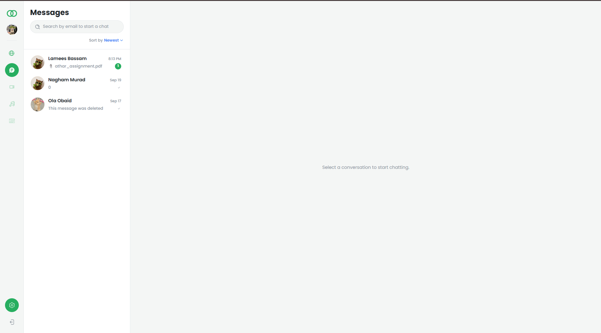
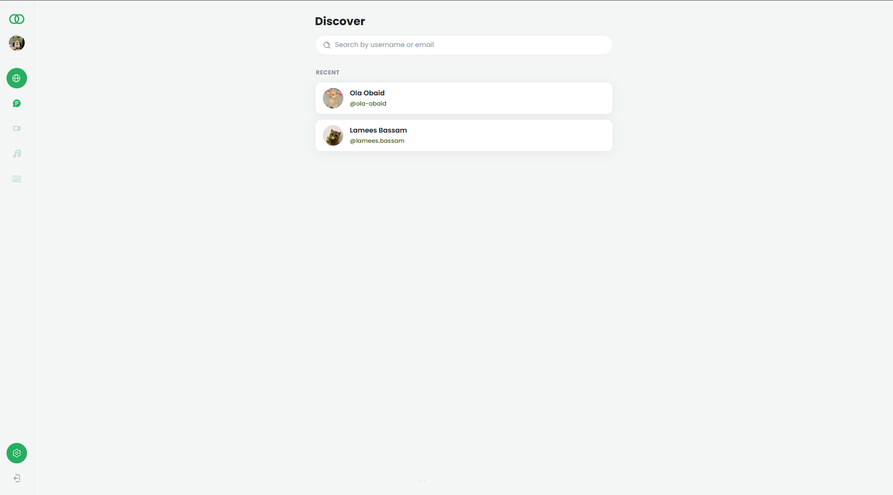
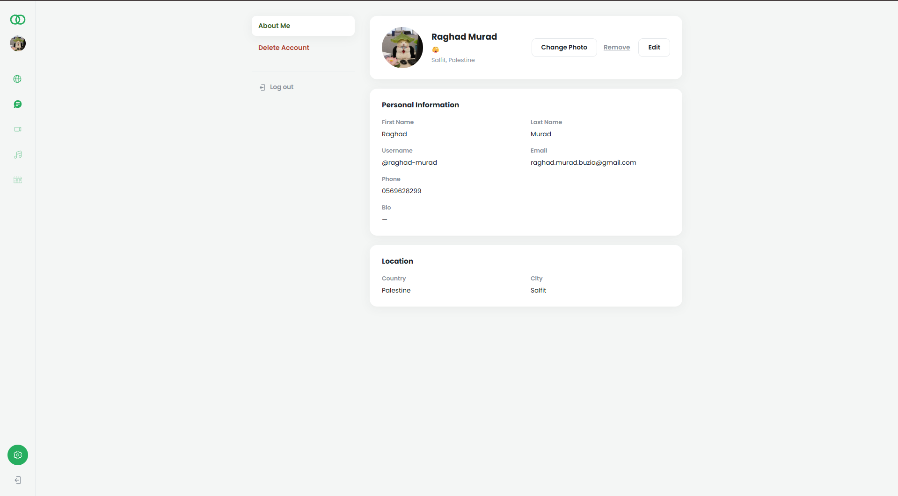
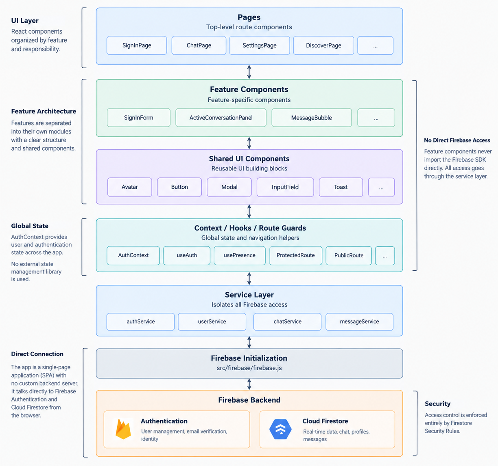
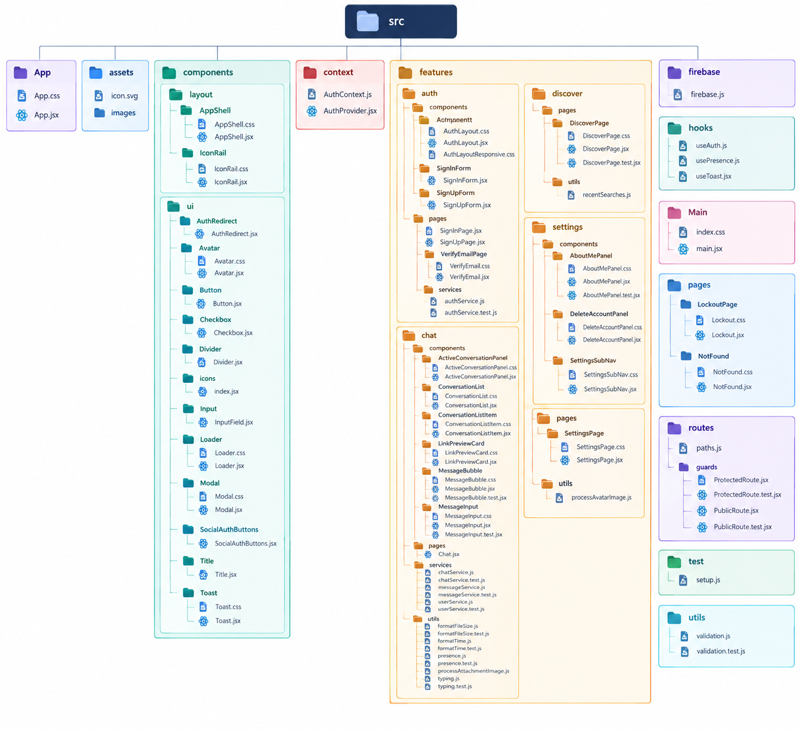

# WebChat

WebChat is a real-time 1:1 messaging web app built with React and Firebase. It supports email/password authentication with email verification, live chat with delivery and read receipts, presence, typing indicators, and image/file attachments, with all media stored directly in Firestore instead of Firebase Storage.

## Screenshots

Screenshots are not included in this repository yet. Once available, they will live in a `screenshots/` folder at the repo root, referenced here as below.

| Page | File |
|---|---|
| Sign In |  |
| Chat |  |
| Discover |  |
| Settings |  |

## Features

### Authentication & Profile

- Email/password sign up and sign in via Firebase Authentication
- Email verification gate: unverified accounts see a "verify your email" screen instead of the app, with automatic detection (polling plus focus/visibility checks) and manual "resend" / "I've verified" actions
- Editable profile ("About Me"): first/last name, phone, bio, status message, country, city
- Required username (lowercase letters, digits, `.`, `_`, `-`, 3-20 characters) used for search on the Discover page
- Profile photo upload, stored as a base64 data URL (cropped to a square, downscaled, and compressed client-side)
- Account deletion (removes the Firebase Auth user and the Firestore profile document)

### Messaging

- Real-time 1:1 conversations, updated live via Firestore listeners (no polling)
- Message status ticks: sent, delivered, and seen, tracked per message
- Image and file attachments, stored as base64 data URLs directly on the message document (images are downscaled and compressed client-side; non-image files are size-capped)
- Soft delete for a single message (the message is tombstoned, not removed, so the thread order is preserved) and hard delete for an entire conversation
- Per-day date dividers in the message thread
- Unread message counts per conversation, shown as a badge and cleared when a conversation is opened
- Typing indicator, shown in both the conversation list and the open chat header
- Presence: online/offline status with a "last seen" time when offline
- Conversations are addressable by URL (`/chat/:chatId`), so a specific conversation can be linked to or reloaded directly

### Discover

- Search for other users by username prefix or exact email address
- A "recent" list of people you have previously started a conversation with, stored locally in the browser
- Starting (or reopening) a conversation from a search result

### User Experience

- Responsive layout with a green-accented theme, usable on both desktop and mobile
- Toast notifications for success/error feedback
- Client-side form validation with inline error messages

## Tech Stack

| Package | Version | Role |
|---|---|---|
| react | 19.1.1 | UI library |
| react-dom | 19.1.1 | React renderer for the browser |
| vite | 7.1.2 | Dev server and build tool |
| firebase | 12.1.0 | Firebase JS SDK (Authentication and Firestore only) |
| react-router-dom | 7.8.1 | Client-side routing |
| eslint | 9.33.0 | Linting (`npm run lint`) |
| vitest | 5.0.1 | Unit and component test runner |
| @testing-library/react | 16.3.0 | Component testing utilities |
| jsdom | 29.1.1 | DOM environment for Vitest |
| @firebase/rules-unit-testing | 5.0.2 | Firestore Security Rules testing against the Firebase emulator |
| firebase-admin | 14.4.0 | Server-side Firebase SDK, used to seed test data for the emulator-based tests |
| @playwright/test | 1.63.0 | End-to-end browser testing |
| cross-env | 10.1.0 | Cross-platform environment variable handling for scripts |

The full dependency list, including a few packages that are installed but not currently used in the codebase, is in `package.json`.

There is no Firebase Storage in this project. Profile avatars and message attachments are both stored as base64-encoded data URLs directly on their Firestore documents, which avoids a separate Storage bucket and its CORS configuration. The tradeoff is Firestore's approximately 1 MB per-document limit, so uploaded images are downscaled and compressed client-side before being saved, and non-image file attachments are rejected above a fixed size cap (well under 1 MB) before they are ever written.

## Architecture

The app is a single-page React application with no custom backend server: it talks to Firebase Authentication and Cloud Firestore directly from the browser, with access control enforced entirely by Firestore Security Rules. Components are organized by feature (auth, chat, settings, discover) plus a small set of shared UI components. All Firebase access is isolated to a service layer: feature components never import the Firebase SDK directly, they call functions exported by a service module instead. Global authentication and profile state is provided by a single `AuthContext`, populated once by an `AuthProvider` at the top of the app and read anywhere via a `useAuth` hook; there is no external state management library.

## Architecture



Real-time updates flow the other direction: the service layer subscribes to Firestore with `onSnapshot`, and the resulting data flows back up into component state, so the UI updates automatically whenever the underlying data changes, without any manual refresh or polling.

## Data Model

**`users/{uid}`** - one document per account:

- `uid`, `name`, `email`
- `online`, `lastSeen` - raw presence fields (the UI derives a staleness-checked online/offline status from these rather than trusting `online` alone)
- `photoURL` - base64 data URL, or null
- `username` - required, lowercase, not guaranteed unique
- `firstName`, `lastName`, `phone`, `bio`, `statusMessage`, `country`, `city`, `updatedAt`
- `profileCompleted` - whether the user has completed their profile setup

**`chats/{chatId}`** - one document per 1:1 conversation. The document id is generated deterministically from the two participants' user ids (sorted and joined), so the same pair of users always maps to the same conversation without needing a lookup query.

- `participants` - an array of the two user ids
- `lastMessage`, `lastMessageSenderId`, `updatedAt`
- `unreadCounts` - a map of user id to unread message count for that user
- `typing` - a map of user id to a timestamp, used to derive a live "is typing" indicator

**`chats/{chatId}/messages/{messageId}`** - one document per message, in a subcollection:

- `senderId`, `text`, `createdAt`
- `status` - `sent`, `delivered`, or `seen`
- `attachment` - an optional object with the attachment's base64 data URL, name, type, and size
- `deleted` - present and `true` after a message is soft-deleted; the document itself is kept (with its content cleared) rather than removed, so the conversation's ordering is preserved

**Security rules**, in plain terms:

- A user can only write to their own profile document, but any signed-in user can read any profile.
- Only the two participants of a conversation can read, update, or delete that conversation, and only a participant can create one.
- Only the two participants of a conversation can read its messages. A message can only be created by the participant whose id matches its `senderId` field (a user cannot create a message impersonating someone else).
- An existing message can only be updated in two limited ways: any participant may update just the `status` field (for delivery/read receipts), or the original sender may update only the soft-delete fields on their own message. No other field changes are permitted.
- Deleting a message document outright is allowed for any participant, which is what powers whole-conversation deletion.

## Getting Started

**Prerequisites:** Node.js and npm, and a Firebase project with Authentication and Cloud Firestore enabled.

Clone the repository and install dependencies:

```bash
git clone <repository-url>
cd React-Firebase-Chat-main
npm install
```

Create your local environment file from the example:

```bash
cp .env.example .env
```

Fill in `.env` with your own Firebase project's web app configuration (these are placeholders, not real values):

```
VITE_FIREBASE_API_KEY=your-api-key
VITE_FIREBASE_AUTH_DOMAIN=your-project.firebaseapp.com
VITE_FIREBASE_PROJECT_ID=your-project-id
VITE_FIREBASE_STORAGE_BUCKET=your-project.appspot.com
VITE_FIREBASE_MESSAGING_SENDER_ID=000000000000
VITE_FIREBASE_APP_ID=1:000000000000:web:0000000000000000000000
```

In the Firebase console, for your project:

1. Enable **Authentication** and turn on the **Email/Password** sign-in provider.
2. Enable **Cloud Firestore**.
3. Deploy the included security rules and indexes using the Firebase CLI:

```bash
npx firebase-tools deploy --only firestore:rules,firestore:indexes
```

Then start the dev server:

```bash
npm run dev
```

## Testing

The project has three independent layers of automated tests:

- `npm test` - unit and component tests, run with Vitest and jsdom. Covers pure utility functions (validation, date/time formatting, presence and typing derivation), the service layer with the Firebase SDK mocked, and key React components and route guards. 126 tests.
- `npm run test:rules` - Firestore Security Rules tests, run against the real `firestore.rules` file using the Firebase Local Emulator. Covers read/write access for profiles, conversations, and messages, including the sender-only and status-only update restrictions described above. 26 tests.
- `npm run e2e` - end-to-end tests, run with Playwright against a real Chromium browser and the Firebase Auth and Firestore emulators together. Covers the full sign-up and email-verification flow, real-time messaging and receipts between two simulated users, attachment sending, and a scroll-position regression test. 5 tests.

The rules and end-to-end layers require a Java runtime, since the Firestore emulator is Java-based.

## Project Structure



## Notable Engineering Decisions

- **Media stored as base64 in Firestore, not Firebase Storage.** Avoids a separate Storage bucket and its CORS setup, at the cost of Firestore's roughly 1 MB per-document limit; attachments and avatars are downscaled and compressed client-side to fit.
- **Deterministic conversation ids.** A conversation's document id is derived from its two participants' user ids, so the same pair of users always resolves to the same conversation document without a query.
- **Presence via a periodic heartbeat plus a "last seen" timestamp**, rather than a realtime-database disconnect hook. A user's displayed online status is derived by checking both the stored flag and how recent their last heartbeat was, so a closed tab or lost connection still resolves to "offline" within a short window even without an explicit sign-out.
- **Per-action post-authentication routing.** Where a user lands after signing up versus signing in is decided directly by the sign-up and sign-in forms themselves (new accounts go to profile setup, returning accounts go to chat), rather than by a persistent route-level check on profile completeness.

## Author

Raghad Buzia
GitHub: raghad-murad

> Documentation is still being finalized. More detailed docs are in progress and will be added over time, and some sections of this README may be refined further.
